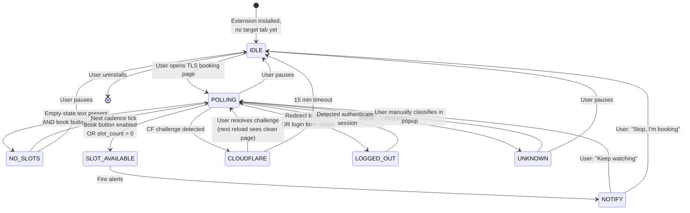
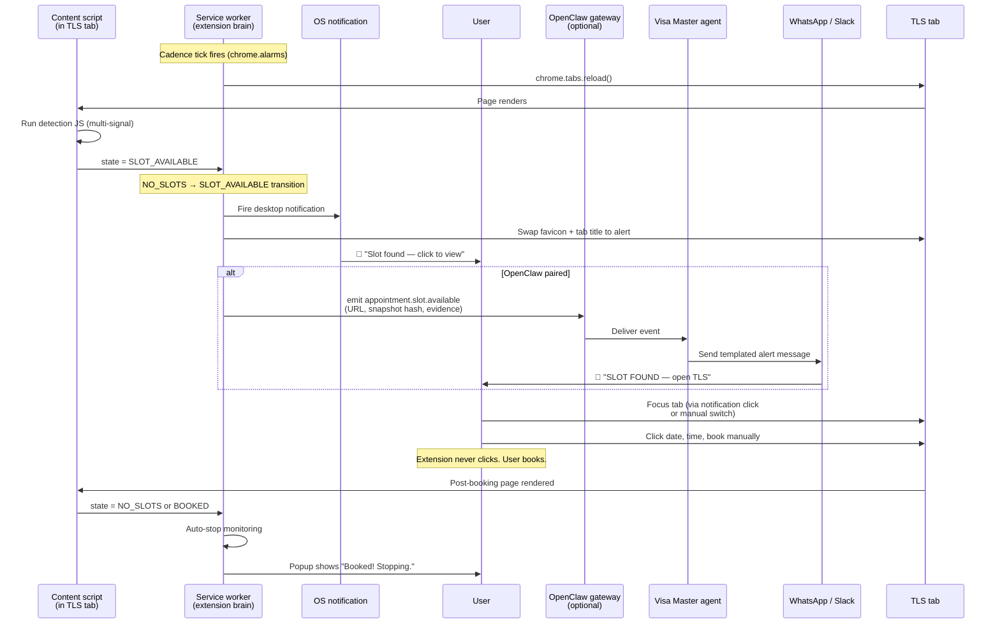

# Wireframes: Visa Master Chrome Extension

**Document:** 07-chrome-extension-wireframes.md
**Version:** 1.0
**Date:** 2026-05-12
**Status:** Draft for review
**Companion to:** `06-visa-master-chrome-extension-prd.md`

---

## How to read this document

These are **low-fidelity ASCII wireframes** — they nail down structure, hierarchy, and information density without committing to visual design. Pixel-perfect mockups come later, after the PRD is approved and an actual designer is involved. The point here is to make sure the product manager, engineer, and reviewer all share the same mental picture of what each screen contains.

ASCII matches the convention used throughout `/platform/` (the architecture and OpenClaw docs both use box-drawing diagrams), keeps everything in plain git, and is comfortable to read in any editor.

**Conventions used below:**

```
┌─── ─── ─── ─── ─── ─── ─── ─── ─── ─── ─── ─── ┐
│  ●  Status dot — green = active                 │
│  ⚠  Warning indicator                           │
│  🚨 Urgent / win-state indicator                │
│  [ Button text ]            ← primary action    │
│  ☑ checked   ☐ unchecked                        │
│  ○ unselected radio   ● selected radio          │
│  [ ... ▼ ]                  ← dropdown          │
│  ●●○○○                      ← slider position   │
└─── ─── ─── ─── ─── ─── ─── ─── ─── ─── ─── ─── ┘
```

**Coverage of major workflows in this doc:**

| § | Screen / flow | PRD reference |
|---|---|---|
| 1 | First-run welcome and consent | PRD §6.1, §7.1 |
| 2 | Popup — Active monitoring (no slots) | PRD §6.2, §7.7 |
| 3 | Popup — Slot detected (the "win" state) | PRD §6.2, §7.4 |
| 4 | Popup — Logged out | PRD §6.5, §7.3 |
| 5 | Popup — Cloudflare challenge | PRD §6.4, §7.3 |
| 6 | Popup — Paused / idle | PRD §7.7 |
| 7 | Popup — Unknown state (manual classification) | PRD §7.4, §10.3 |
| 8 | Settings page (full options) | PRD §7.7 |
| 9 | OpenClaw pairing wizard (two steps) | PRD §7.5 |
| 10 | Desktop notifications (OS-level) | PRD §7.4 |
| 11 | Browser action icon and badge states | PRD §7.7 |
| 12 | End-to-end onboarding sequence | PRD §6.1 |
| 13 | Detection state machine | PRD §10.1 |
| 14 | Slot-found end-to-end flow | PRD §6.2, §6.3 |
| 15 | Annotated information architecture | — |

---

## 1. First-run welcome and consent

Opens automatically in a full tab when the user first installs the extension. **One screen, must be read top-to-bottom, single primary action.** No data is read, no polling starts, until the user clicks the green button.

```
┌────────────────────────────────────────────────────────────────────────┐
│                                                                        │
│   [VM]  Visa Master — Appointment Watcher                  [×]         │
│                                                                        │
├────────────────────────────────────────────────────────────────────────┤
│                                                                        │
│                                                                        │
│         Welcome — the privacy-first way to catch your TLS slot.        │
│                                                                        │
│                                                                        │
│   ┌──────────────────────────────────────────────────────────────┐    │
│   │                                                              │    │
│   │   WHAT I DO                                                  │    │
│   │                                                              │    │
│   │   ✓  Refresh your TLScontact appointment page on a polite    │    │
│   │      cadence (every 2–15 minutes; default 4).                │    │
│   │                                                              │    │
│   │   ✓  Notify you the instant a slot opens — desktop alert     │    │
│   │      plus optional sound.                                    │    │
│   │                                                              │    │
│   │   ✓  Run entirely in your own browser. Your login session    │    │
│   │      never leaves this computer.                             │    │
│   │                                                              │    │
│   └──────────────────────────────────────────────────────────────┘    │
│                                                                        │
│   ┌──────────────────────────────────────────────────────────────┐    │
│   │                                                              │    │
│   │   WHAT I DO NOT DO                                           │    │
│   │                                                              │    │
│   │   ✗  Never read your passport number, name, or form fields.  │    │
│   │   ✗  Never book the slot for you — you always book yourself. │    │
│   │   ✗  Never solve Cloudflare captchas — I'll ask you.         │    │
│   │   ✗  Never share your data with anyone, ever.                │    │
│   │                                                              │    │
│   └──────────────────────────────────────────────────────────────┘    │
│                                                                        │
│   ⚠   Note: TLScontact's terms of service may classify automation     │
│       as prohibited. I keep polling polite to minimize risk, but you   │
│       use this at your own risk. Open-source — verify what I do:       │
│       github.com/visa-master/chrome-extension                          │
│                                                                        │
│                                                                        │
│       Language:   [ English                ▼ ]                         │
│                                                                        │
│                                                                        │
│              ┌────────────────────────────────────────┐                │
│              │   I understand — start monitoring  →   │                │
│              └────────────────────────────────────────┘                │
│                                                                        │
│                                                                        │
│       Privacy policy   ·   Source code   ·   Reference docs            │
│                                                                        │
└────────────────────────────────────────────────────────────────────────┘
```

**Design notes**
- Single primary CTA. No secondary "Skip" or "Maybe later" — the install is the consent moment.
- The "do not" list is as long as the "do" list. Deliberate — it builds trust.
- Language picker visible at consent time, before any text shows up in the wrong language and confuses someone.
- The disclaimer about ToS is visible *before* the user can click the CTA. No dark patterns.

---

## 2. Popup — Active monitoring (no slots)

The everyday state. User clicks the extension icon; this is what they see. Designed to be **glanceable in under 2 seconds**.

```
┌──────────────────────────────────────────────────┐
│  ●  Monitoring                       [ ⚙ ] [ ⋯ ] │
├──────────────────────────────────────────────────┤
│                                                  │
│  TLScontact Manchester                           │
│  France visa · gbMNC2fr                          │
│                                                  │
│  ┌──────────────────────────────────────────┐    │
│  │                                          │    │
│  │   Last checked:   2 min ago              │    │
│  │   Next check:     in 2 min               │    │
│  │   Status:         No slots available     │    │
│  │                                          │    │
│  └──────────────────────────────────────────┘    │
│                                                  │
│  Cadence                                         │
│  Aggressive  ●●○○○  Gentle                       │
│       (currently: every 4 min)                   │
│                                                  │
│   ┌───────────────┐    ┌───────────────────┐    │
│   │  ⏸  Pause     │    │  ↻  Check now     │    │
│   └───────────────┘    └───────────────────┘    │
│                                                  │
├──────────────────────────────────────────────────┤
│  📊  Today: 142 checks · 0 slots                │
│  🔔  Notifications: ON                          │
│  🔗  OpenClaw: Connected                        │
└──────────────────────────────────────────────────┘
```

**Design notes**
- Green dot in header = active. Single token of state in the corner of the user's eye.
- Three lines of vital signs in a single boxed block: glanceable.
- Cadence is a slider, not a dropdown. Spectrum encoding makes the tradeoff visible.
- "Check now" exists for impatience but cannot reduce the actual rate (rate-limited server-side in the extension).
- Footer is mini-status — Notifications/OpenClaw indicators reassure the user that the channels are alive.

---

## 3. Popup — Slot detected

The win state. Visually distinct, single primary action, no decoration that competes for attention.

```
┌──────────────────────────────────────────────────┐
│  🚨  SLOT FOUND                      [ ⚙ ] [ ⋯ ] │ ◄── red header
├──────────────────────────────────────────────────┤
│                                                  │
│         A slot is available — go book it.        │
│                                                  │
│  TLScontact Manchester                           │
│  Detected: just now (07:13:42 UTC)               │
│                                                  │
│  ┌──────────────────────────────────────────┐    │
│  │                                          │    │
│  │   ⚠  SLOTS DISAPPEAR IN UNDER 60 SECONDS  │    │
│  │      Switch to the TLS tab and book NOW.  │    │
│  │                                          │    │
│  └──────────────────────────────────────────┘    │
│                                                  │
│   ┌─────────────────────────────────────────┐    │
│   │                                         │    │
│   │   🎯   Open TLScontact tab              │    │ ◄── giant button
│   │                                         │    │     auto-focused
│   └─────────────────────────────────────────┘    │
│                                                  │
│  Detection evidence:                             │
│    ✓ Book button is enabled                      │
│    ✓ 3 slot elements found                       │
│    ✓ "No slots" text is gone                     │
│                                                  │
│  ┌────────────────────────────────────────────┐  │
│  │  Acknowledge & keep watching              │  │
│  └────────────────────────────────────────────┘  │
│  ┌────────────────────────────────────────────┐  │
│  │  Stop — I'm booking now                   │  │
│  └────────────────────────────────────────────┘  │
└──────────────────────────────────────────────────┘
```

**Design notes**
- Red header, urgent emoji. Zero ambiguity.
- "Open TLS tab" button is dominant in size and pre-focused. Spacebar / enter activates it.
- Detection evidence is visible but quiet. Trust through transparency — the user can verify *why* the extension thinks there's a slot, not just trust it.
- "Acknowledge & keep watching" exists because slots sometimes come in a quick burst and the next family member also wants one.
- "Stop — I'm booking now" auto-stops monitoring so the post-booking page doesn't fire a confusing "still no slots" loop.

---

## 4. Popup — Logged out

A non-scary, helpful state. The user did nothing wrong; their session just expired.

```
┌──────────────────────────────────────────────────┐
│  ⚠  Logged out                       [ ⚙ ] [ ⋯ ] │ ◄── amber header
├──────────────────────────────────────────────────┤
│                                                  │
│  Your TLScontact session expired.                │
│                                                  │
│  I can't watch a logged-out page. Log back in    │
│  and I'll resume monitoring automatically.       │
│                                                  │
│   ┌─────────────────────────────────────────┐    │
│   │                                         │    │
│   │   ↗   Go to the TLScontact login        │    │
│   │                                         │    │
│   └─────────────────────────────────────────┘    │
│                                                  │
│  Last successful check: 12 min ago               │
│  Monitoring is paused until you log in.          │
│                                                  │
└──────────────────────────────────────────────────┘
```

**Design notes**
- Amber, not red. This is a routine event, not an emergency.
- One clear action.
- "I'll resume automatically" is reassuring — they don't need to click "Resume" later.

---

## 5. Popup — Cloudflare challenge

The trickiest state. The extension is doing the right thing (stopping rather than fighting), but the user needs to understand why.

```
┌──────────────────────────────────────────────────┐
│  ⚠  Security check needed            [ ⚙ ] [ ⋯ ] │
├──────────────────────────────────────────────────┤
│                                                  │
│  Cloudflare is asking you to verify you're       │
│  human. This is normal.                          │
│                                                  │
│  What to do:                                     │
│    1. Click the TLScontact tab.                  │
│    2. Complete the Cloudflare check.             │
│    3. I'll resume polling automatically.         │
│                                                  │
│  Why am I not solving it for you?                │
│  Solving Cloudflare challenges is exactly the    │
│  pattern that gets accounts banned. I won't.     │
│                                                  │
│   ┌─────────────────────────────────────────┐    │
│   │                                         │    │
│   │   ↗   Go to the TLScontact tab          │    │
│   │                                         │    │
│   └─────────────────────────────────────────┘    │
│                                                  │
│  Detected at: 07:08:14 UTC                       │
│  Auto-stop in: 14 min if unresolved              │
│                                                  │
└──────────────────────────────────────────────────┘
```

**Design notes**
- The "Why am I not solving it" line is critical. Without it, users will reasonably ask "why doesn't this thing handle the CAPTCHA?" and feel let down. The honest answer is also our strongest trust signal.
- 15-minute auto-stop prevents zombie monitors after the user closes the browser without resolving.

---

## 6. Popup — Paused / idle

A neutral, low-stakes state.

```
┌──────────────────────────────────────────────────┐
│  ○  Paused                           [ ⚙ ] [ ⋯ ] │ ◄── grey header
├──────────────────────────────────────────────────┤
│                                                  │
│  TLScontact Manchester                           │
│  France visa · gbMNC2fr                          │
│                                                  │
│  Monitoring is paused. Nothing is being checked. │
│                                                  │
│  Last status: No slots (paused 23 min ago)       │
│                                                  │
│   ┌─────────────────────────────────────────┐    │
│   │                                         │    │
│   │   ▶  Resume monitoring                  │    │
│   │                                         │    │
│   └─────────────────────────────────────────┘    │
│                                                  │
└──────────────────────────────────────────────────┘
```

---

## 7. Popup — Unknown state (manual classification)

When the page shape changes (e.g. TLScontact ships a redesign), the extension may not be able to classify the state. Rather than guess (and false-positive), it asks the user once.

```
┌──────────────────────────────────────────────────┐
│  ?  Help me classify this page       [ ⚙ ] [ ⋯ ] │
├──────────────────────────────────────────────────┤
│                                                  │
│  I see a TLScontact page but the signals are     │
│  ambiguous. Glance at the tab — what do you see? │
│                                                  │
│  ○  No slots available                           │
│  ○  Slots ARE available right now                │
│  ○  Cloudflare challenge / security check        │
│  ○  Logged out                                   │
│  ○  Something else (show me page details)        │
│                                                  │
│   ┌─────────────────────────────────────────┐    │
│   │   Save my answer and continue           │    │
│   └─────────────────────────────────────────┘    │
│                                                  │
│  Anonymous snapshot hash: a8f3e2…                │
│  Optionally [ Submit hash to help us improve ]   │
│                                                  │
└──────────────────────────────────────────────────┘
```

**Design notes**
- Asks once, remembers the answer, learns. Locale dictionary gets patched in the next remote config push.
- "Snapshot hash" is a non-PII way the user can opt to help — uploads a hash, not the page content.

---

## 8. Settings page

Opens in a full tab from the gear icon. Grouped, scannable, no sidebar.

```
┌────────────────────────────────────────────────────────────────────────┐
│  ←  Settings                                          Visa Master      │
├────────────────────────────────────────────────────────────────────────┤
│                                                                        │
│  ▣  Monitoring                                                         │
│  ─────────────                                                         │
│  Target:    TLScontact Manchester (gbMNC2fr)         [ Change ▼ ]      │
│  URL:       https://visas-fr.tlscontact.com/workflow/…                 │
│             Auto-detected from your open tab                           │
│                                                                        │
│  Cadence:                                                              │
│     ○ Aggressive   (every 2 min) — higher Cloudflare risk             │
│     ● Smart        (auto-adjusts around release windows) [recommended] │
│     ○ Gentle       (every 10 min) — lowest risk                        │
│     ○ Custom       [   4  ] minutes                                    │
│                                                                        │
│                                                                        │
│  ▣  Release windows                                                    │
│  ─────────────                                                         │
│  ☑  Use known UK release windows                                       │
│       06:00 – 09:30 UK time   →  poll every [ 2 ] min                  │
│       23:30 – 00:30 UK time   →  poll every [ 2 ] min                  │
│       All other times         →  poll every [ 6 ] min                  │
│                                                                        │
│                                                                        │
│  ▣  Notifications                                                      │
│  ─────────────                                                         │
│  ☑  Desktop notification on slot detected                              │
│  ☑  Play sound                       [ Sample sound ]                  │
│  ☑  Change tab title and favicon                                       │
│  ☐  Auto-focus the TLS tab on detection                                │
│                                                                        │
│                                                                        │
│  ▣  OpenClaw integration                                               │
│  ─────────────                                                         │
│  Status:    ●  Connected                                               │
│  Gateway:   ws://127.0.0.1:18789                                       │
│  Node ID:   VM-NODE-7K3L-9PQR-XXXX                                     │
│  [ Disconnect ]    [ Re-pair ]    [ Test event ]                       │
│                                                                        │
│                                                                        │
│  ▣  Language                                                           │
│  ─────────────                                                         │
│  Detection language: [ Chinese 中文           ▼ ]                      │
│  UI language:        [ English                ▼ ]                      │
│  (Detection language must match TLScontact account setting)            │
│                                                                        │
│                                                                        │
│  ▣  Privacy                                                            │
│  ─────────────                                                         │
│  ☐  Anonymous telemetry — helps us improve detection                   │
│       What's sent: poll counts, error counts (no URLs, no PII)         │
│  ☑  Encrypt OpenClaw token with a passphrase                           │
│       [ Change passphrase ]                                            │
│                                                                        │
│                                                                        │
│  ▣  About                                                              │
│  ─────────────                                                         │
│  Version:    1.0.0                                                     │
│  Source:     github.com/visa-master/chrome-extension                   │
│  License:    MIT                                                       │
│  [ Report a bug ]    [ Reference docs ]    [ View detection log ]      │
│                                                                        │
└────────────────────────────────────────────────────────────────────────┘
```

**Design notes**
- Each section is a horizontal rule + heading + content. No sidebar nav — page is short enough.
- "Smart" is marked `[recommended]` — guide the default.
- Privacy section is explicit about what telemetry contains (and excludes).
- "View detection log" links to the local-only history page (next wireframe candidate; not blocking V1).

---

## 9. OpenClaw pairing wizard

Two-step modal, opens from the OpenClaw section above.

**Step 1: Gateway address**

```
┌─────────────────────────────────────────────────────────┐
│  Pair with OpenClaw gateway                       [×]   │
├─────────────────────────────────────────────────────────┤
│                                                         │
│  Step 1 of 2 — Gateway address                          │
│                                                         │
│  Where is your OpenClaw gateway running?                │
│                                                         │
│  ┌───────────────────────────────────────────────┐      │
│  │  ws://127.0.0.1:18789                         │      │
│  └───────────────────────────────────────────────┘      │
│                                                         │
│  Most local setups use the default above.               │
│  For a remote gateway, use:                             │
│    wss://your-gateway.example.com/openclaw              │
│                                                         │
│                                                         │
│                              ┌─────────────────────┐    │
│                              │   Next  →           │    │
│                              └─────────────────────┘    │
└─────────────────────────────────────────────────────────┘
```

**Step 2: Pairing token**

```
┌─────────────────────────────────────────────────────────┐
│  Pair with OpenClaw gateway                       [×]   │
├─────────────────────────────────────────────────────────┤
│                                                         │
│  Step 2 of 2 — Pairing token                            │
│                                                         │
│  Run this command on your OpenClaw host:                │
│                                                         │
│  ┌───────────────────────────────────────────────────┐  │
│  │                                                   │  │
│  │   $ openclaw pairing create \                     │  │
│  │       --capability appointment-watcher            │  │
│  │                                                   │  │
│  │   Token:  VM-NODE-7K3L-9PQR-XXXX                  │  │
│  │                                                   │  │
│  └───────────────────────────────────────────────────┘  │
│  [ Copy command ]                                       │
│                                                         │
│  Paste the token here:                                  │
│  ┌───────────────────────────────────────────────┐      │
│  │  VM-NODE-                                     │      │
│  └───────────────────────────────────────────────┘      │
│                                                         │
│  Encrypt with passphrase (recommended):                 │
│  ┌───────────────────────────────────────────────┐      │
│  │  •••••••••                                    │      │
│  └───────────────────────────────────────────────┘      │
│                                                         │
│  ┌────────────────┐         ┌─────────────────────┐    │
│  │   ←  Back      │         │   Pair  →           │    │
│  └────────────────┘         └─────────────────────┘    │
└─────────────────────────────────────────────────────────┘
```

**Design notes**
- The command is copyable — small UX cliff if it's not.
- Token is single-use, exchanged for a long-lived cert (PRD §7.5).
- Passphrase is optional but defaulted to recommended for users with shared computers.

---

## 10. Desktop notifications (OS-level)

Rendered by the operating system, so we don't control exact layout. These are the content/strings we ship.

**Slot found notification**

```
┌──────────────────────────────────────────┐
│  🚨   Visa Master                        │
│                                          │
│  Slot available — TLScontact Manchester  │
│  Click to open                           │
│                                          │
└──────────────────────────────────────────┘
        ^ click → focuses the TLS tab
        ^ does NOT open or navigate anywhere new
```

**Cloudflare challenge notification**

```
┌──────────────────────────────────────────┐
│  ⚠   Visa Master                         │
│                                          │
│  Cloudflare check needed                 │
│  Click to resolve in the TLS tab         │
│                                          │
└──────────────────────────────────────────┘
```

**Logged out notification**

```
┌──────────────────────────────────────────┐
│  ⚠   Visa Master                         │
│                                          │
│  TLScontact session expired              │
│  Log back in to resume monitoring        │
│                                          │
└──────────────────────────────────────────┘
```

**Design notes**
- Notification body always starts with the *outcome* (slot, challenge, logout) not the brand. The user sees the headline first.
- Click action is always "focus the existing TLS tab" — never open a new tab. Defense-in-depth against accidental navigation.

---

## 11. Browser action icon and badge states

The extension icon sits in the Chrome toolbar. Its colored badge gives the user a glanceable status without opening the popup.

```
[VM]                  Idle, no target detected. Grey icon, no badge.

[VM]●                 Monitoring, no slots. Green dot badge.

[VM]🚨                Slot found! Red badge. Animated pulse for first 60s.

[VM]⚠                 Logged out or CF challenge. Amber badge.

[VM]⏸                 User-paused. Outline pause icon.
```

Tooltip on hover for each state shows the latest status line (e.g., "Last check: 2 min ago — no slots").

---

## 12. End-to-end onboarding sequence

How the user gets from "saw the extension on the Web Store" to "monitoring is running."

```mermaid
sequenceDiagram
    actor U as User
    participant CWS as Chrome Web Store
    participant Ext as Extension
    participant Tab as TLScontact tab

    U->>CWS: Click "Add to Chrome"
    CWS->>Ext: Install (manifest review)
    Ext->>U: Auto-open welcome tab (full page)
    U->>Ext: Read what it does / does not do
    U->>Ext: Pick UI language
    U->>Ext: Click "I understand — start monitoring"
    Note over Ext: Permissions granted; no polling yet
    Ext->>U: Popup auto-opens, says<br/>"Open your TLS booking page"
    U->>Tab: Navigate to TLS appointment URL
    Note over Tab: User already logged in
    Tab->>Ext: Content script auto-injects on URL match
    Ext->>Ext: Begin polling at default cadence
    Ext->>U: Badge turns green; popup shows "Monitoring"
```

**Total time from install to first poll: under 60 seconds** (PRD §3.3 success metric).

---

## 13. Detection state machine

The brain of the extension. Every poll runs through this.



**Transition rules summary**
- Any state can fall to `IDLE` via user pause.
- `NOTIFY` is the only state that fires desktop alerts. Other transitions are silent.
- `UNKNOWN → POLLING` requires explicit user input — never assumed.
- `CLOUDFLARE` and `LOGGED_OUT` automatically resume polling when the underlying condition clears.

---

## 14. Slot-found end-to-end flow

Everything that happens between "slot opens on TLS" and "user has booked it." This is the critical-path flow.



**Why this flow is right:**
- The notification has **two independent delivery paths** (desktop + WhatsApp via OpenClaw). Either one alone is sufficient; both together is robust.
- The extension **never clicks the Book button.** That's the inviolable line.
- Auto-stop after booking prevents the next poll from confusing the user with a "now there are no slots again" message.

---

## 15. Annotated information architecture

A bird's-eye view of every surface and where things live.

```
Browser-action icon (toolbar)
│
├── Badge: status (green / red / amber / pause / nothing)
│
└── Click → Popup (520 × variable, anchored to icon)
    │
    ├── Header
    │   ├── Status dot + label
    │   ├── Gear icon → Settings (new tab)
    │   └── Overflow menu (⋯)
    │       ├── View detection history
    │       ├── Export local data
    │       └── Help / report bug
    │
    ├── Main body (state-dependent)
    │   ├── §2 Monitoring view
    │   ├── §3 Slot-found view
    │   ├── §4 Logged-out view
    │   ├── §5 Cloudflare-challenge view
    │   ├── §6 Paused view
    │   └── §7 Unknown view
    │
    └── Footer (mini-status, always visible)
        ├── Today's check count
        ├── Notification on/off
        └── OpenClaw connected indicator

Welcome tab (full page)
│
└── First-run consent (§1)

Settings tab (full page)
│
├── Monitoring (target, cadence)
├── Release windows
├── Notifications
├── OpenClaw integration
│   └── Pairing wizard (§9 — modal over settings)
├── Language
├── Privacy
└── About

Desktop notifications (OS-rendered)
│
├── Slot found
├── Cloudflare challenge
└── Logged out
```

---

## 16. What's not wireframed (yet)

Deferred to V1.1 design pass or a future doc:

| Screen | Why deferred |
|---|---|
| Detection history (local-only log) | V1.0 has the log but a simple table is fine; no UX risk |
| Multi-language locale picker per surface | Same as today; not on critical path |
| Multi-centre monitoring (Manchester + London) | Out of V1 scope per PRD §17.2 #1 |
| OpenClaw command surface (inbound from agent to extension) | Engineering-side; no user-facing UI |
| Error / diagnostic screen for "extension broken, please reinstall" | Edge case; not blocking |

---

## Sources and cross-references

- PRD: `/docs/06-visa-master-chrome-extension-prd.md`
- Architecture: `/platform/architecture/02-system-architecture.md` (esp. §2.2 Appointment Agent)
- OpenClaw integration: `/platform/integrations/03-openclaw-channels.md`
- Empirical detection signals from 2026-05-12 prototype: scheduled task `tlscontact-manchester-slot-watch`
