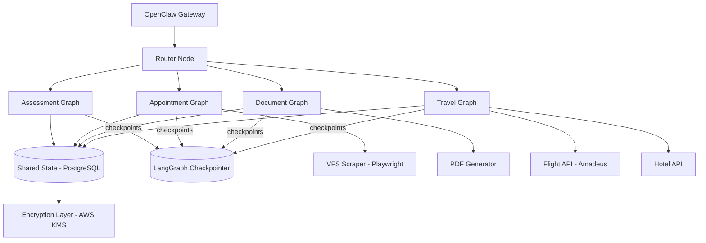

# System Architecture: Multi-Agent Schengen Visa Platform

**Version:** 1.0
**Date:** 2026-03-14
**Status:** Design / Research

---

## Table of Contents

1. [Platform Overview](#1-platform-overview)
2. [Core Agents](#2-core-agents)
3. [Architecture Option A: Claude Agent SDK + MCP](#3-architecture-option-a-claude-agent-sdk--mcp)
4. [Architecture Option B: LangGraph Multi-Agent](#4-architecture-option-b-langgraph-multi-agent)
5. [Architecture Option C: Custom Orchestrator](#5-architecture-option-c-custom-orchestrator)
6. [Comparison Matrix](#6-comparison-matrix)
7. [Cross-Cutting Concerns](#7-cross-cutting-concerns)
8. [Recommendation](#8-recommendation)

---

## 1. Platform Overview

### 1.1 Mission

Automate end-to-end Schengen visa applications through a team of specialized AI agents that communicate with users exclusively via WhatsApp and Slack, using OpenClaw as the messaging gateway.

### 1.2 High-Level Data Flow

```
User (WhatsApp / Slack)
        |
        v
  +-----------+
  | OpenClaw  |  <-- Messaging gateway (WhatsApp, Slack)
  | Gateway   |      Hub-and-spoke WebSocket architecture
  +-----------+
        |
        v
  +----------------+
  |  Orchestrator  |  <-- Routes intent, manages agent handoffs
  +----------------+
        |
   +---------+---------+---------+
   |         |         |         |
   v         v         v         v
+------+  +------+  +------+  +------+
|Assess|  |Appt  |  |Doc   |  |Travel|
|Agent |  |Agent |  |Agent |  |Agent |
+------+  +------+  +------+  +------+
   |         |         |         |
   v         v         v         v
+------+  +------+  +------+  +------+
|Rules |  |VFS   |  |PDF   |  |Flight|
|Engine|  |Scrape|  |Gen   |  |Hotel |
+------+  +------+  +------+  +------+
```

### 1.3 Communication Channels

| Channel   | Gateway       | Features Used                          |
|-----------|---------------|----------------------------------------|
| WhatsApp  | OpenClaw      | Text, images (document photos), PDFs   |
| Slack     | OpenClaw      | Text streaming, threads, file uploads  |

OpenClaw acts as the unified gateway. Its hub-and-spoke WebSocket architecture routes messages from 20+ platforms to the agent runtime. For this platform, only WhatsApp and Slack channels are enabled.

---

## 2. Core Agents

### 2.1 Assessment Agent

**Purpose:** Evaluate visa readiness, identify gaps, assess refusal risk.

| Responsibility                     | Inputs                              | Outputs                              |
|------------------------------------|-------------------------------------|---------------------------------------|
| Profile intake questionnaire       | User answers via chat               | Structured applicant profile          |
| Document checklist generation      | Profile + target country rules      | Personalized checklist with status    |
| Risk assessment                    | Profile + historical refusal data   | Risk score (low/medium/high) + flags  |
| Missing document identification    | Uploaded docs vs. checklist         | Gap analysis with action items        |

**Key data sources:**
- Schengen Visa Code (EU Regulation 810/2009) requirements per Article 14
- Country-specific consulate requirements (29 Schengen member states)
- Historical refusal pattern data

### 2.2 Appointment Agent

**Purpose:** Monitor VFS Global for available slots, alert users, optionally auto-book.

| Responsibility                     | Inputs                              | Outputs                              |
|------------------------------------|-------------------------------------|---------------------------------------|
| Slot monitoring (24/7)             | Target consulate + date range       | Available slot alerts                 |
| Auto-alert on availability         | User preferences                    | WhatsApp/Slack notification           |
| Auto-booking (with consent)        | User credentials + slot selection   | Booking confirmation                  |
| Retry on CAPTCHA / rate-limit      | Failed booking attempts             | Escalation or retry                   |

**Technical challenges:**
- VFS Global uses advanced CAPTCHA and rate-limiting
- Frequent login requests trigger temporary blocking
- No official API -- requires browser automation (Playwright/Selenium)
- CAPTCHA solving APIs (2Captcha, Anti-Captcha) may be needed
- Must mimic human browsing patterns with intelligent request timing

### 2.3 Document Agent

**Purpose:** Draft, validate, and finalize all application documents.

| Responsibility                     | Inputs                              | Outputs                              |
|------------------------------------|-------------------------------------|---------------------------------------|
| Cover letter drafting              | Applicant profile + trip purpose    | Formatted cover letter (PDF)         |
| Sponsorship letter drafting        | Sponsor details + relationship      | Sponsorship letter (PDF)             |
| Itinerary document creation        | Travel dates + bookings             | Day-by-day itinerary (PDF)           |
| Document validation                | Uploaded documents                  | Compliance report per consulate rules|
| Photo specification check          | Uploaded passport photo             | Pass/fail + guidance                 |

### 2.4 Travel Agent

**Purpose:** Plan itineraries and manage bookings that satisfy visa requirements.

| Responsibility                     | Inputs                              | Outputs                              |
|------------------------------------|-------------------------------------|---------------------------------------|
| Itinerary planning                 | Travel dates + preferences          | Optimized itinerary                  |
| Flight booking (refundable)        | Dates + airports                    | Flight reservation (PNR)             |
| Hotel booking (refundable)         | Dates + cities                      | Hotel confirmation                   |
| Date consistency validation        | All bookings + application dates    | Consistency report                   |
| Insurance recommendation           | Travel dates + coverage needs       | Insurance options (min EUR 30,000)   |

**Booking requirements for visa applications:**
- Flights must be refundable or reservation-only (not purchased)
- Hotels must cover all nights in Schengen area
- Dates must be consistent across flight, hotel, itinerary, and application form
- Travel insurance must provide minimum EUR 30,000 medical coverage

---

## 3. Architecture Option A: Claude Agent SDK + MCP

### 3.1 Overview

Use Anthropic's Claude Agent SDK (Python v0.1.48) as the agent runtime with Model Context Protocol (MCP) servers for tool integration. Each agent is an SDK agent instance with its own system prompt and MCP tools.

### 3.2 System Diagram

```
                    +---------------------------+
                    |        OpenClaw           |
                    |   (WhatsApp + Slack)      |
                    +-------------|-------------+
                                  | WebSocket
                                  v
                    +---------------------------+
                    |    Lead Agent (Claude)     |
                    |  Claude Agent SDK runtime  |
                    |  - Intent classification   |
                    |  - Agent delegation        |
                    |  - Context synthesis       |
                    +-----|-------|-------|------+
                          |       |       |
              +-----------+   +---+   +---+-----------+
              |               |               |               |
     +--------v---+  +--------v---+  +--------v---+  +--------v---+
     | Assessment |  |Appointment |  |  Document  |  |  Travel    |
     | Sub-Agent  |  | Sub-Agent  |  | Sub-Agent  |  | Sub-Agent  |
     | (Claude)   |  | (Claude)   |  | (Claude)   |  | (Claude)   |
     +-----+------+  +-----+------+  +-----+------+  +-----+------+
           |                |                |                |
     +-----v------+  +-----v------+  +-----v------+  +-----v------+
     | MCP Server |  | MCP Server |  | MCP Server |  | MCP Server |
     | - Rules DB |  | - Playwright|  | - PDF Gen  |  | - Amadeus  |
     | - Risk ML  |  | - CAPTCHA  |  | - Templates|  | - Booking  |
     | - Profiles |  | - Scheduler|  | - Validator|  | - Hotels   |
     +------------+  +------------+  +------------+  +------------+
                              |
                    +---------v---------+
                    |  Shared State DB  |
                    |   (PostgreSQL +   |
                    |    Redis cache)   |
                    +-------------------+
```

### 3.3 Component Details

| Component               | Technology                        | Responsibility                                |
|--------------------------|-----------------------------------|-----------------------------------------------|
| Lead Agent               | Claude Agent SDK (Opus 4)         | Intent routing, agent delegation, synthesis   |
| Sub-Agents (x4)          | Claude Agent SDK (Sonnet 4)       | Domain-specific reasoning + tool use          |
| MCP Servers (in-process) | `create_sdk_mcp_server()` Python  | Tool wrappers for external services           |
| State Store              | PostgreSQL + Redis                | Application state, session cache              |
| VFS Monitor              | Playwright + Celery beat          | Headless browser polling every 5-10 min       |
| Document Generator       | WeasyPrint / ReportLab            | PDF generation from templates                 |
| Booking APIs             | Amadeus / Duffel / Kiwi.com      | Flight search + reservation                   |
| Hotel APIs               | Booking.com Partner API / Agoda   | Hotel search + refundable booking             |
| Encryption               | AWS KMS / age                     | PII encryption at rest and in transit         |

### 3.4 Data Flow: User Submits a New Application

```
1. User sends "I want to apply for a France Schengen visa" via WhatsApp
2. OpenClaw relays message to Lead Agent via WebSocket
3. Lead Agent classifies intent --> delegates to Assessment Agent
4. Assessment Agent starts intake questionnaire via MCP tool (chat Q&A)
5. User answers are stored in PostgreSQL (encrypted PII fields)
6. Assessment Agent generates checklist + risk score
7. Lead Agent receives results, presents to user
8. Lead Agent delegates to Travel Agent for itinerary planning
9. Travel Agent queries Amadeus MCP for flights, returns options
10. User confirms selections
11. Lead Agent delegates to Document Agent for cover letter
12. Document Agent drafts letter using profile + itinerary context
13. Lead Agent delegates to Appointment Agent to start monitoring VFS
14. All agents share context via shared state in PostgreSQL
```

### 3.5 Pros and Cons

| Pros                                            | Cons                                               |
|--------------------------------------------------|----------------------------------------------------|
| Native Claude integration -- best prompt quality | Vendor lock-in to Anthropic                        |
| MCP is an open standard with growing ecosystem   | Agent SDK is pre-1.0 (v0.1.48) -- API may change  |
| In-process MCP servers reduce latency            | Limited multi-model support (Claude only)          |
| Built-in tool use, context management             | Agent Teams feature is experimental                |
| Simplest architecture of the three options        | Debugging multi-agent flows is harder              |
| Lowest code volume to build                       | Cost scales linearly with agent invocations        |

### 3.6 Estimated Complexity and Timeline

| Phase                    | Duration   | Effort      |
|--------------------------|------------|-------------|
| Core infrastructure      | 2 weeks    | 1 developer |
| Assessment Agent + MCP   | 2 weeks    | 1 developer |
| Document Agent + MCP     | 2 weeks    | 1 developer |
| Travel Agent + APIs      | 3 weeks    | 1 developer |
| Appointment Agent + VFS  | 3 weeks    | 1 developer |
| OpenClaw integration     | 1 week     | 1 developer |
| Testing + hardening      | 2 weeks    | 1 developer |
| **Total**                | **~15 weeks** | **1-2 devs** |

### 3.7 Cost Model

| Item                          | Monthly Cost (10 users)  | Monthly Cost (1,000 users) |
|-------------------------------|--------------------------|----------------------------|
| Claude API (Opus for lead)    | $50-100                  | $3,000-5,000               |
| Claude API (Sonnet for agents)| $30-60                   | $2,000-4,000               |
| PostgreSQL (managed)          | $15                      | $100                       |
| Redis                         | $10                      | $50                        |
| VFS monitoring server         | $20                      | $200                       |
| Booking API fees              | $0 (pay per booking)     | $0 (pay per booking)       |
| OpenClaw hosting              | $10                      | $50                        |
| **Total infra**               | **~$135-215/mo**         | **~$5,400-9,400/mo**       |

---

## 4. Architecture Option B: LangGraph Multi-Agent

### 4.1 Overview

Use LangGraph v1.0 as the orchestration framework with its graph-based state machine for agent workflows. LangGraph provides durable execution, built-in persistence, and first-class human-in-the-loop patterns.

### 4.2 System Diagram



```
                    +---------------------------+
                    |        OpenClaw           |
                    |   (WhatsApp + Slack)      |
                    +-------------|-------------+
                                  |
                    +-------------v-------------+
                    |      LangGraph App        |
                    |   (FastAPI + LangServe)   |
                    +-------------|-------------+
                                  |
                    +-------------v-------------+
                    |    Router StateGraph      |
                    |  (intent classification   |
                    |   + conditional edges)    |
                    +-----|-------|-------|------+
                          |       |       |
              +-----------+       |       +-----------+
              |                   |                   |
     +--------v--------+ +-------v--------+ +--------v--------+
     | Assessment Graph | | Document Graph | | Travel Graph    |
     | (Sub-StateGraph) | | (Sub-StateGraph)| | (Sub-StateGraph)|
     |                  | |                | |                 |
     | Nodes:           | | Nodes:         | | Nodes:          |
     | - intake         | | - draft        | | - search_flights|
     | - analyze_docs   | | - validate     | | - search_hotels |
     | - score_risk     | | - generate_pdf | | - validate_dates|
     | - gen_checklist   | | - review       | | - book          |
     +---------+--------+ +-------+--------+ +--------+--------+
               |                  |                    |
               v                  v                    v
     +---------+------------------+--------------------+--------+
     |                  LangGraph Checkpointer                  |
     |            (PostgreSQL-backed durable state)             |
     +----------------------------------------------------------+
```

### 4.3 Component Details

| Component               | Technology                          | Responsibility                              |
|--------------------------|-------------------------------------|----------------------------------------------|
| Router Graph             | LangGraph StateGraph                | Intent routing via conditional edges         |
| Sub-Graphs (x4)          | LangGraph Sub-StateGraphs           | Domain workflows as directed graphs          |
| LLM Nodes                | Claude Sonnet 4 via LangChain       | Reasoning within graph nodes                 |
| Checkpointer             | PostgreSQL checkpointer             | Durable state, resume after failures         |
| Tool Nodes               | LangChain tool wrappers             | API calls, scraping, PDF generation          |
| Deployment               | LangGraph Platform / LangServe      | Managed hosting with monitoring              |
| Human-in-the-loop        | LangGraph `interrupt()` primitive   | Pause execution for user confirmation        |

### 4.4 Key LangGraph Features Used

- **Durable execution:** Agents persist through failures and resume from checkpoints automatically
- **Human-in-the-loop:** First-class `interrupt()` API pauses execution for user review (e.g., before booking a flight)
- **Conditional edges:** Router uses `ConditionalEdgeRouter` to dispatch to the correct sub-graph
- **Sub-graphs:** Each agent is a self-contained StateGraph that can be tested independently
- **Streaming:** Native token streaming for real-time responses via OpenClaw to WhatsApp/Slack
- **State schema:** `TypedDict` state shared across all nodes with reducer functions for merging

### 4.5 Pros and Cons

| Pros                                              | Cons                                               |
|----------------------------------------------------|----------------------------------------------------|
| Production-ready v1.0 with durable execution       | Steeper learning curve (graph concepts)            |
| Best human-in-the-loop support of all three options| More boilerplate code than Claude SDK              |
| Model-agnostic -- can use Claude, GPT, Gemini      | LangChain abstraction layer adds complexity        |
| Built-in persistence and checkpointing             | Debugging graph execution requires LangSmith       |
| LangGraph Platform for managed deployment           | Platform hosting adds cost                         |
| Excellent observability via LangSmith               | Graph topology is rigid once defined               |
| gRPC API for high-performance thread management    | Overkill for simple agent interactions             |

### 4.6 Estimated Complexity and Timeline

| Phase                    | Duration   | Effort      |
|--------------------------|------------|-------------|
| Core infrastructure      | 2 weeks    | 1 developer |
| Graph design + router    | 2 weeks    | 1 developer |
| Assessment sub-graph     | 2 weeks    | 1 developer |
| Document sub-graph       | 2 weeks    | 1 developer |
| Travel sub-graph         | 3 weeks    | 1 developer |
| Appointment sub-graph    | 3 weeks    | 1 developer |
| OpenClaw integration     | 1 week     | 1 developer |
| Testing + hardening      | 3 weeks    | 1 developer |
| **Total**                | **~18 weeks** | **1-2 devs** |

### 4.7 Cost Model

| Item                          | Monthly Cost (10 users)  | Monthly Cost (1,000 users) |
|-------------------------------|--------------------------|----------------------------|
| Claude API (Sonnet via LC)    | $60-120                  | $4,000-7,000               |
| LangGraph Platform            | $0 (self-host) / $49+    | $499+ (managed)            |
| LangSmith (observability)     | $0 (free tier)           | $400+                      |
| PostgreSQL (managed)          | $15                      | $100                       |
| Redis                         | $10                      | $50                        |
| VFS monitoring server         | $20                      | $200                       |
| OpenClaw hosting              | $10                      | $50                        |
| **Total infra**               | **~$115-225/mo**         | **~$5,300-7,900/mo**       |

---

## 5. Architecture Option C: Custom Orchestrator

### 5.1 Overview

Build a custom event-driven orchestrator using message queues for agent communication. Each agent is an independent microservice that consumes from and publishes to queues. This provides maximum control and flexibility at the cost of more engineering effort.

### 5.2 System Diagram

```
                    +---------------------------+
                    |        OpenClaw           |
                    |   (WhatsApp + Slack)      |
                    +-------------|-------------+
                                  | WebSocket
                                  v
                    +---------------------------+
                    |      API Gateway          |
                    |       (FastAPI)           |
                    +-------------|-------------+
                                  |
                    +-------------v-------------+
                    |    Event Router Service   |
                    |  - Intent classification  |
                    |  - Session management     |
                    |  - Agent lifecycle        |
                    +-------------|-------------+
                                  |
                    +-------------v-------------+
                    |     Message Broker        |
                    |    (Redis Streams /       |
                    |     RabbitMQ / NATS)      |
                    +-----|-------|-------|------+
                          |       |       |
              +-----------+       |       +-----------+
              |                   |                   |
     +--------v--------+ +-------v--------+ +--------v--------+
     | Assessment       | | Document       | | Travel          |
     | Service          | | Service        | | Service         |
     | (FastAPI worker) | | (FastAPI worker)| | (FastAPI worker)|
     |                  | |                | |                 |
     | - Claude Sonnet  | | - Claude Sonnet| | - Claude Sonnet |
     | - Rules engine   | | - PDF gen      | | - Amadeus API   |
     | - Risk model     | | - Validators   | | - Hotel API     |
     +---------+--------+ +-------+--------+ +--------+--------+
               |                  |                    |
               v                  v                    v
     +---------+------------------+--------------------+--------+
     |              PostgreSQL (shared state)                    |
     |         + Redis (cache + pub/sub + sessions)             |
     +----------------------------------------------------------+
               |
     +---------v------------------+
     | Appointment Worker Service |
     | (Celery Beat + Playwright) |
     | - Scheduled VFS polling    |
     | - CAPTCHA solving          |
     | - Slot alert dispatch      |
     +----------------------------+
```

### 5.3 Component Details

| Component                | Technology                         | Responsibility                              |
|---------------------------|------------------------------------|----------------------------------------------|
| API Gateway               | FastAPI                            | HTTP/WebSocket endpoint for OpenClaw         |
| Event Router              | Custom Python service              | Intent classification + queue dispatch       |
| Message Broker            | Redis Streams (small) / NATS (large)| Async agent communication                   |
| Agent Services (x4)       | FastAPI workers                    | Domain logic + LLM calls                    |
| LLM Client                | Anthropic Python SDK (direct)      | Claude API calls without framework overhead  |
| Task Queue                | Celery + Redis                     | Background tasks (VFS polling, PDF gen)      |
| State Store               | PostgreSQL                         | Application state, user profiles             |
| Cache                     | Redis                              | Session data, rate limiting, pub/sub         |
| Document Storage           | S3 / MinIO                         | Generated PDFs, uploaded documents           |
| Encryption                | AWS KMS + application-level AES    | PII encryption                               |
| Monitoring                | Prometheus + Grafana               | Metrics, alerting, dashboards                |

### 5.4 Event-Driven Communication Pattern

```
Event Schema:
{
  "event_id": "uuid",
  "type": "assessment.checklist.generated",
  "user_id": "uuid",
  "application_id": "uuid",
  "timestamp": "2026-03-14T10:00:00Z",
  "payload": { ... },
  "source_agent": "assessment",
  "target_agent": "document"  // optional, for directed events
}

Event Types:
- user.message.received
- assessment.intake.started
- assessment.checklist.generated
- assessment.risk.scored
- appointment.slot.found
- appointment.slot.booked
- document.draft.created
- document.validation.completed
- travel.itinerary.planned
- travel.flight.reserved
- travel.hotel.booked
- orchestrator.handoff.requested
```

### 5.5 Pros and Cons

| Pros                                              | Cons                                                |
|----------------------------------------------------|-----------------------------------------------------|
| Full control over every component                  | Most engineering effort (2-3x more code)            |
| No framework lock-in                               | Must build state management from scratch            |
| Model-agnostic -- swap LLMs per agent              | Must build human-in-the-loop from scratch           |
| Best scalability (independent service scaling)     | Must build observability from scratch               |
| Event-driven = natural audit trail                  | More operational complexity (multiple services)     |
| Can optimize cost per agent (different models)     | Higher initial infrastructure cost                  |
| Easiest to add non-AI services                     | Risk of re-inventing what frameworks already provide|

### 5.6 Estimated Complexity and Timeline

| Phase                      | Duration   | Effort      |
|----------------------------|------------|-------------|
| Core infrastructure + broker| 3 weeks    | 1 developer |
| Event router + state mgmt  | 2 weeks    | 1 developer |
| Assessment service          | 2 weeks    | 1 developer |
| Document service            | 3 weeks    | 1 developer |
| Travel service              | 3 weeks    | 1 developer |
| Appointment service + VFS   | 3 weeks    | 1 developer |
| OpenClaw integration        | 1 week     | 1 developer |
| Observability + monitoring  | 2 weeks    | 1 developer |
| Testing + hardening         | 3 weeks    | 1 developer |
| **Total**                   | **~22 weeks** | **1-2 devs** |

### 5.7 Cost Model

| Item                          | Monthly Cost (10 users)  | Monthly Cost (1,000 users) |
|-------------------------------|--------------------------|----------------------------|
| Claude API (direct, Sonnet)   | $40-80                   | $3,000-5,000               |
| PostgreSQL (managed)          | $15                      | $100                       |
| Redis                         | $10                      | $50                        |
| NATS / RabbitMQ               | $0 (self-host)           | $50                        |
| VFS monitoring server         | $20                      | $200                       |
| Compute (containers x4-6)    | $40                      | $400                       |
| S3 storage                    | $5                       | $50                        |
| Monitoring (Grafana Cloud)    | $0 (free tier)           | $50                        |
| OpenClaw hosting              | $10                      | $50                        |
| **Total infra**               | **~$140-180/mo**         | **~$3,950-5,950/mo**       |

---

## 6. Comparison Matrix

| Criterion                  | Option A: Claude SDK + MCP | Option B: LangGraph      | Option C: Custom Orchestrator |
|----------------------------|----------------------------|--------------------------|-------------------------------|
| **Development speed**      | Fastest (~15 weeks)        | Medium (~18 weeks)       | Slowest (~22 weeks)           |
| **Code volume**            | Low                        | Medium                   | High                          |
| **Framework maturity**     | Pre-1.0 (v0.1.48)         | Production v1.0          | N/A (custom)                  |
| **LLM flexibility**       | Claude only                | Any LLM                  | Any LLM                       |
| **State management**       | Custom (PostgreSQL)        | Built-in checkpointer    | Custom (PostgreSQL)           |
| **Human-in-the-loop**     | Manual implementation      | First-class `interrupt()` | Manual implementation         |
| **Durable execution**      | Not built-in               | Built-in                  | Manual (with retry logic)     |
| **Scalability ceiling**   | Medium                     | High (LangGraph Platform)| Highest (microservices)       |
| **Observability**         | Basic logging              | LangSmith integration    | Custom (Prometheus/Grafana)   |
| **Vendor lock-in**        | High (Anthropic)           | Medium (LangChain)       | Low                           |
| **Cost at 10 users**      | ~$175/mo                   | ~$170/mo                 | ~$160/mo                      |
| **Cost at 1,000 users**   | ~$7,400/mo                 | ~$6,600/mo               | ~$4,950/mo                    |
| **Cost at 10,000 users**  | ~$60,000/mo                | ~$55,000/mo              | ~$40,000/mo                   |
| **Maintenance burden**    | Low                        | Medium                   | High                          |
| **Team expertise needed** | Claude SDK + MCP           | LangGraph + LangChain    | Distributed systems           |

---

## 7. Cross-Cutting Concerns

### 7.1 State Management

Each user's application progresses through defined stages. State must persist across chat sessions, agent handoffs, and system restarts.

```
Application State Machine:

  INTAKE --> ASSESSING --> CHECKLIST_GENERATED --> DOCUMENTS_IN_PROGRESS
      \                                               |
       \                                              v
        \                              DOCUMENTS_COMPLETE --> BOOKING_TRAVEL
         \                                                        |
          \                                                       v
           \                                    TRAVEL_BOOKED --> MONITORING_APPOINTMENTS
            \                                                        |
             \                                                       v
              +---> APPOINTMENT_BOOKED --> READY_FOR_SUBMISSION --> SUBMITTED
```

**State schema (PostgreSQL):**

```sql
CREATE TABLE applications (
    id              UUID PRIMARY KEY DEFAULT gen_random_uuid(),
    user_id         UUID NOT NULL REFERENCES users(id),
    target_country  VARCHAR(2) NOT NULL,       -- ISO country code
    visa_type       VARCHAR(20) DEFAULT 'C',   -- C = short-stay Schengen
    status          VARCHAR(50) NOT NULL,
    risk_score      DECIMAL(3,2),
    checklist       JSONB,                     -- document checklist with status
    travel_dates    JSONB,                     -- {departure, return, cities}
    bookings        JSONB,                     -- {flights, hotels, insurance}
    agent_context   JSONB,                     -- shared context for all agents
    pii_encrypted   BYTEA,                     -- AES-256 encrypted PII blob
    created_at      TIMESTAMPTZ DEFAULT NOW(),
    updated_at      TIMESTAMPTZ DEFAULT NOW()
);

CREATE TABLE application_events (
    id              UUID PRIMARY KEY DEFAULT gen_random_uuid(),
    application_id  UUID NOT NULL REFERENCES applications(id),
    event_type      VARCHAR(100) NOT NULL,
    agent           VARCHAR(50) NOT NULL,
    payload         JSONB,
    created_at      TIMESTAMPTZ DEFAULT NOW()
);

CREATE TABLE sessions (
    id              UUID PRIMARY KEY DEFAULT gen_random_uuid(),
    user_id         UUID NOT NULL REFERENCES users(id),
    channel         VARCHAR(20) NOT NULL,      -- 'whatsapp' or 'slack'
    channel_user_id VARCHAR(100) NOT NULL,     -- platform-specific user ID
    last_agent      VARCHAR(50),
    context_window  JSONB,                     -- recent conversation context
    expires_at      TIMESTAMPTZ
);
```

**Cross-session continuity:**
- Redis stores the active session context (last 20 messages + current agent state)
- PostgreSQL stores the durable application state
- When a user returns after hours/days, the system loads their application state and resumes from the last checkpoint
- Each agent reads from `agent_context` JSONB field to get shared knowledge

### 7.2 Sensitive Data and PII Handling

| Data Category        | Classification | Storage                    | Retention            |
|----------------------|----------------|----------------------------|----------------------|
| Passport details     | Critical PII   | AES-256 encrypted (KMS)   | Until visa decision  |
| Financial documents  | Sensitive       | AES-256 encrypted          | Until visa decision  |
| Travel dates/plans   | Internal       | PostgreSQL (plaintext)     | 1 year               |
| Chat messages        | Internal       | Redis (ephemeral)          | 30 days              |
| Generated documents  | Confidential   | S3 with SSE-S3 encryption | Until visa decision  |
| Booking references   | Internal       | PostgreSQL (plaintext)     | 1 year               |

**Encryption strategy:**
- PII fields are encrypted at the application level using AES-256-GCM before storage
- Encryption keys managed by AWS KMS (or age for self-hosted)
- LLM prompts containing PII are sent over TLS and not logged
- OpenClaw messages containing PII are not persisted beyond the session window
- Data deletion: automated cleanup after visa decision + configurable grace period

**Compliance considerations:**
- GDPR applies (processing EU visa data)
- Right to deletion must be supported
- Data processing agreement required with LLM provider
- Consider EU-hosted infrastructure to avoid cross-border data transfer issues

### 7.3 Human-in-the-Loop Decision Matrix

| Action                              | Autonomy Level     | Rationale                                     |
|--------------------------------------|--------------------|-------------------------------------------------|
| Answering visa requirement questions | Fully autonomous   | Low risk, informational only                   |
| Generating document checklists       | Fully autonomous   | Low risk, can be regenerated                   |
| Drafting cover/sponsorship letters   | Review required    | User must verify facts before submission       |
| Booking refundable flights           | Confirmation required | Financial commitment, even if refundable     |
| Booking refundable hotels            | Confirmation required | Financial commitment                         |
| Auto-booking VFS appointment         | Explicit opt-in    | Uses user's credentials, irreversible          |
| Submitting visa application          | NEVER autonomous   | Legal implications, always human-submitted     |
| Sharing PII with third parties       | NEVER autonomous   | Privacy and legal requirements                 |
| Risk assessment disclosure           | Review required    | Sensitive information, must be contextualized  |

**Implementation pattern (all options):**

```python
# Confirmation flow via OpenClaw
async def request_confirmation(user_id: str, action: str, details: dict):
    """Send confirmation request and wait for user response."""
    message = format_confirmation_message(action, details)
    await openclaw.send(user_id, message)  # "Shall I book this flight? [Yes/No]"

    # Wait for response (with timeout)
    response = await openclaw.wait_for_response(
        user_id,
        timeout=timedelta(hours=24),
        reminder_after=timedelta(hours=2)
    )

    if response.confirmed:
        return await execute_action(action, details)
    else:
        return await handle_rejection(action, response.reason)
```

### 7.4 Error Handling and Resilience

| Failure Scenario                   | Detection                    | Response                                      |
|-------------------------------------|------------------------------|------------------------------------------------|
| VFS Global is down                  | HTTP 5xx / timeout           | Retry with exponential backoff; alert user after 1 hour of downtime |
| VFS CAPTCHA blocks automation       | CAPTCHA detection in DOM     | Route to CAPTCHA solving API; fallback to manual alert for user |
| VFS rate-limits our IP              | HTTP 429 / temporary block   | Rotate proxy; increase polling interval; alert ops team |
| Flight sells out after user confirms| Booking API returns error    | Immediately search alternatives; notify user with options |
| Hotel price changes                 | Booking API price mismatch   | Re-confirm with user at new price              |
| Claude API rate limit               | HTTP 429                     | Queue request; retry after delay; degrade to smaller model |
| Claude API outage                   | HTTP 5xx                     | Queue messages; inform user of delay; retry    |
| OpenClaw WebSocket disconnects      | Connection dropped           | Auto-reconnect with exponential backoff        |
| User goes silent mid-flow           | No response for 24h+         | Send reminder; pause agent work; resume on return |
| Invalid document uploaded           | Validation failure           | Explain issue to user; request re-upload       |
| Inconsistent dates across bookings  | Cross-validation check       | Flag to user; suggest corrections              |

**Circuit breaker pattern for external services:**

```python
# Circuit breaker for VFS monitoring
class VFSCircuitBreaker:
    FAILURE_THRESHOLD = 5
    RECOVERY_TIMEOUT = 300  # seconds

    states: CLOSED -> OPEN -> HALF_OPEN -> CLOSED
    # CLOSED: normal operation
    # OPEN: stop calling VFS, alert ops team
    # HALF_OPEN: try one request, if success -> CLOSED
```

### 7.5 Scalability: From 10 to 10,000 Users

| Scale         | Architecture Needs                                                  |
|---------------|----------------------------------------------------------------------|
| **10 users**  | Single server, SQLite/PostgreSQL, single Celery worker for VFS       |
| **100 users** | Managed PostgreSQL, Redis, 2-3 Celery workers, connection pooling    |
| **1,000 users** | Horizontal scaling of agent workers, read replicas, rate limit management, dedicated VFS proxy pool |
| **10,000 users** | Kubernetes orchestration, auto-scaling agent pods, distributed queue (NATS/Kafka), geographic proxy distribution for VFS, CDN for generated documents, database sharding by region |

**Bottleneck analysis:**

| Component              | Bottleneck at Scale              | Mitigation                              |
|------------------------|-----------------------------------|-----------------------------------------|
| LLM API calls          | Rate limits + cost               | Request batching, caching, smaller models for simple tasks |
| VFS scraping           | IP blocking + rate limits        | Proxy rotation, distributed monitoring nodes |
| PostgreSQL             | Write throughput at 10K users    | Connection pooling, read replicas, partitioning |
| OpenClaw               | WebSocket connection limits      | Multiple OpenClaw instances behind load balancer |
| Document generation    | CPU-intensive PDF rendering      | Async queue with dedicated workers      |

**Cost optimization strategies at scale:**
- Use Claude Haiku for simple classification tasks (intent routing, yes/no questions)
- Use Claude Sonnet for standard agent reasoning
- Reserve Claude Opus for complex risk assessments only
- Cache common responses (visa requirements rarely change)
- Batch similar queries across users (e.g., "France requirements" served from cache)

### 7.6 Multi-Country and Multi-Visa-Type Extensibility

```
Country Configuration Schema:

countries/
  FR/
    requirements.yaml     # France-specific document requirements
    consulates.yaml       # Consulate addresses, hours, VFS centers
    cover_letter.jinja2   # France-specific cover letter template
    checklist.yaml        # France-specific checklist items
  DE/
    requirements.yaml
    consulates.yaml
    cover_letter.jinja2
    checklist.yaml
  ...

visa_types/
  C_tourism.yaml          # Short-stay tourism
  C_business.yaml         # Short-stay business
  C_family.yaml           # Short-stay family visit
  D_study.yaml            # Long-stay study (future)
  D_work.yaml             # Long-stay work (future)
```

Adding a new Schengen country requires:
1. Creating the country config directory with YAML files
2. Adding consulate/VFS center details
3. Customizing document templates (if country has specific requirements)
4. No code changes required -- agents read from config

---

## 8. Recommendation

### Primary Recommendation: Option A (Claude Agent SDK + MCP) for MVP, migrate to Option B (LangGraph) for scale

**Rationale:**

1. **Speed to market:** Option A gets to a working MVP in ~15 weeks. The visa application market is competitive and time-sensitive (seasonal demand spikes around European summer).

2. **Simplest architecture:** MCP servers provide clean tool integration without framework overhead. The Claude Agent SDK's `create_sdk_mcp_server()` lets you define tools in-process with minimal boilerplate.

3. **Best LLM quality for this domain:** Visa applications require nuanced reasoning about regulations, risk assessment, and document quality. Claude's instruction-following and context management are strongest when using the native SDK without abstraction layers.

4. **Migration path:** If/when the platform reaches 1,000+ users and needs durable execution, human-in-the-loop primitives, and multi-model support, LangGraph v1.0 provides a clear upgrade path. The agent logic (prompts, tools, validation rules) transfers directly -- only the orchestration layer changes.

5. **OpenClaw compatibility:** OpenClaw's WebSocket gateway integrates cleanly with any Python backend. The Claude Agent SDK's agent loop can consume messages from OpenClaw and respond through the same channel.

**What to build first (MVP priority):**

```
Phase 1 (Weeks 1-6):   Assessment Agent + OpenClaw integration
Phase 2 (Weeks 7-10):  Document Agent (cover letters + itineraries)
Phase 3 (Weeks 11-13): Appointment Agent (VFS monitoring + alerts)
Phase 4 (Weeks 14-15): Travel Agent (flight/hotel search, manual booking)
Phase 5 (Weeks 16+):   Auto-booking, multi-country, scale optimization
```

### Risk Mitigation

| Risk                                | Mitigation                                          |
|-------------------------------------|-----------------------------------------------------|
| Claude Agent SDK API changes (pre-1.0)| Abstract SDK calls behind internal interface        |
| VFS blocks all automation            | Fall back to manual alerts ("slots available, book now") |
| Anthropic pricing increases          | Architecture supports swapping to other LLMs if needed |
| GDPR compliance gaps                 | Engage privacy counsel before processing real user data |
| OpenClaw stability                   | Self-host OpenClaw instance; monitor upstream releases |

---

## Appendix: Research Sources

- [Claude Agent SDK Python (v0.1.48) - GitHub](https://github.com/anthropics/claude-agent-sdk-python)
- [Claude Agent SDK Overview - Anthropic Docs](https://platform.claude.com/docs/en/agent-sdk/overview)
- [MCP Integration - Claude Agent SDK](https://platform.claude.com/docs/en/agent-sdk/mcp)
- [Agent Teams - Claude Code Docs](https://code.claude.com/docs/en/agent-teams)
- [LangGraph v1.0 - LangChain](https://blog.langchain.com/langchain-langgraph-1dot0/)
- [LangGraph Multi-Agent Orchestration](https://www.langchain.com/langgraph)
- [CrewAI v1.10.1 - Multi-Agent Platform](https://crewai.com/)
- [CrewAI Flows - Event-Driven Orchestration](https://markaicode.com/crewai-flows-event-driven-agent-orchestration/)
- [OpenClaw - Open-Source AI Assistant](https://github.com/openclaw/openclaw)
- [OpenClaw WhatsApp Integration](https://www.marktechpost.com/2026/02/14/getting-started-with-openclaw-and-connecting-it-with-whatsapp/)
- [OpenClaw Slack Integration](https://docs.openclaw.ai/channels/slack)
- [VFS Global Appointment Bot Examples](https://github.com/topics/vfs-global)
- [Schengen Visa Requirements 2026](https://schengenvisainfo.com/schengen-visa-application-requirements/)
- [AI Agent Frameworks Compared 2026](https://letsdatascience.com/blog/ai-agent-frameworks-compared)
- [AI Agent Frameworks Comparison - Turing](https://www.turing.com/resources/ai-agent-frameworks)
